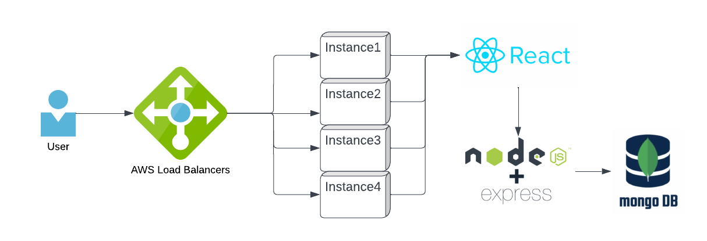
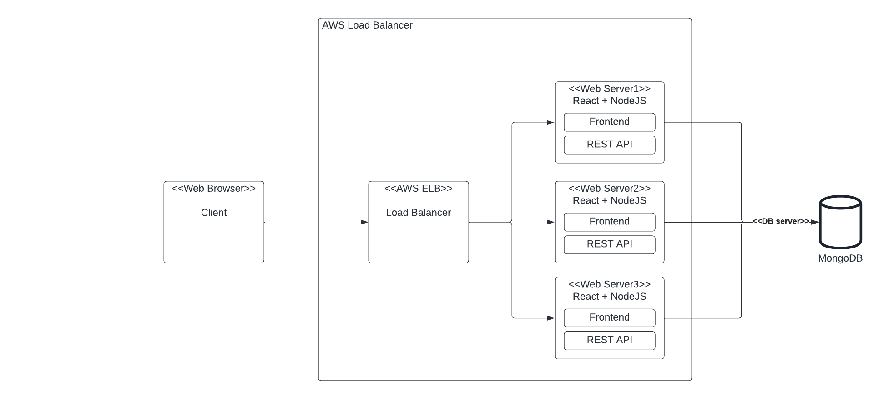
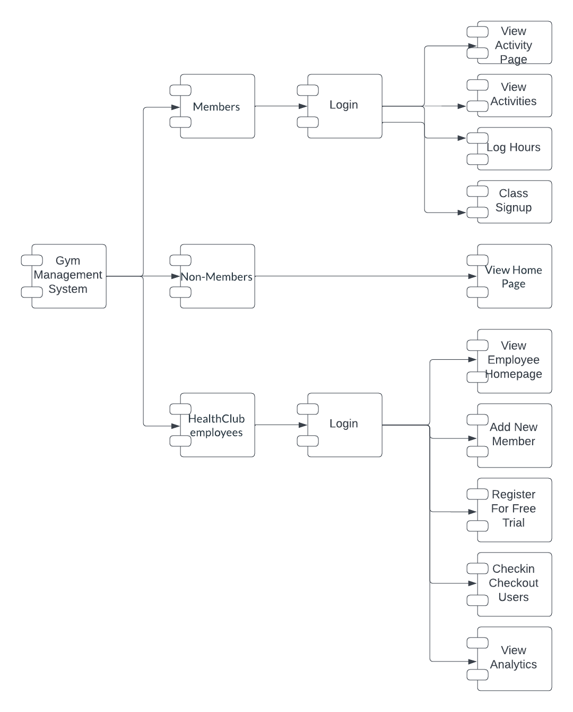

# Team-CPF

## Team Members

016656315 Chiranjeevi Medam (Developer)

016176836 Farazuddin Mohammad (Developer)

016286270 Prajwal Nadagouda (Scrum Master) (Developer)

016724838 Saketh Reddy Awala (Developer)

## Summary of the Contributions

1. Chiranjeevi: Designed database and worked on the home page, enroll new members, checkin members into the gym each day, checkout members as they exit the Gym each day, signup non-members for free trials, and added history of classes taken. Tested the components to make functionality.

2. Farazuddin: Designed database and created view activities in time range, view members page, log hours on the equipments available. Tested all the components that I worked on ensuring complete coverage.

3. Prajwal: Designed the architecture and deployment startegy. Built the wireframes after discussing, signup for classes in advance, pages for locations and members. Finally, handled testing and deployment of the project using AWS ELB - Application Load Balancer with EC2 target group.

4. Saketh: Designed database and built components of analysis for classes and enrollment by time, hours spent in the gym by time period, number of visitors by time category. Tested out the components ensuring correctness.

## Github Repo

https://github.com/gopinathsjsu/team-project-cpf

## Architecture (Monorepo)

1. Front-end: ReactJS, Chakra UI, HTML, CSS

2. Back-end: NodeJS, ExpressJS

3. Database: MongoDB

4. Deployment: AWS EC2, AWS ELB (Application Load Balancer)

## Documentation

[Project Task Board](https://github.com/orgs/gopinathsjsu/projects/71/views/1)

[Project Journal](https://docs.google.com/document/d/1CEIYorbqTy0vKhoMVC-NAvcvrorPO45jI5dUk8pBNMI/edit?usp=sharing)

[Sprint Task + Burndown Chart](https://docs.google.com/spreadsheets/d/1eO75rQXyYkAQMrMZ3tLWUN1WJtMDc_81Scz2rtqvbQw/edit?usp=sharing)

[UI Wireframes](https://docs.google.com/presentation/d/1hZv_-kjKb4ErgBH-kqwJhumV5-bDWGyOdBxTuRH-9Gc/edit?usp=sharing)

## XP Core Values Maintained

Communication: Communication was critical throughout the project to ensure that everyone was on the same page with the project's needs, timeframes, and progress. We used daily scrums, group chat, and calls to keep each other informed and involved. Each team member put conscious effort to communicate and keep track of status. 

Courage: From the first meeting, a space was created to allow for open conversations. We made the best use of the resources and skills that we all possessed while also improving all of our skill sets over time. We talked a lot about technology and architecture. We spent time improving our understanding while debating the optimal method. We had a few debates, but each person was free to propose the finest ideas that would be useful.

## Diagrams

